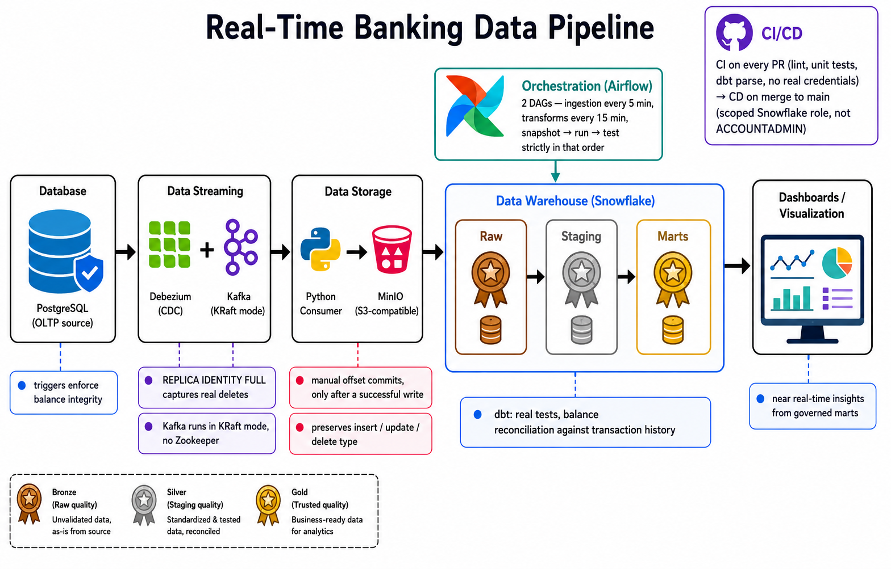

# Real-Time Banking Data Pipeline

A real-time, end-to-end data pipeline simulating a banking system: customer, account, and transaction data captured via change data capture, streamed through Kafka, landed in Snowflake, and transformed with dbt, all fully containerized and orchestrated with Airflow, with automated testing and CI/CD.

This project was built by identifying real, verified bugs in a template project of the same shape, then fixing each one deliberately, with the reasoning behind each fix documented below rather than assumed.

## Architecture



Two Airflow DAGs run this on a schedule: `minio_to_snowflake` (every 5 minutes) loads new files into the raw layer, and `snapshots_and_marts` (every 15 minutes) runs `dbt snapshot`, then `dbt run`, then `dbt test`, strictly in that order.

## Tech stack

- **PostgreSQL 16** — source OLTP database, with triggers enforcing balance integrity at the database level
- **Debezium 3.0 / Kafka Connect** — captures inserts, updates, and deletes from Postgres's write-ahead log
- **Apache Kafka 4.3** — running in KRaft mode; no Zookeeper, which Kafka fully removed as of version 4.0
- **Python** — a realistic, continuously running data generator and a Kafka consumer with manual offset management
- **MinIO** — S3-compatible object storage, standing in for AWS S3 in local development
- **Apache Airflow 3.3** — orchestrates both ingestion and transformation, using LocalExecutor
- **Snowflake** — the cloud data warehouse, with raw, staging, snapshot, and mart layers
- **dbt-core 1.12 / dbt-snowflake** — staging models, SCD Type 2 snapshots, dimensional marts, and real automated tests
- **Docker Compose** — containerizes the entire local stack
- **GitHub Actions** — CI on every branch and pull request, CD on merge to `main`

## Key design decisions

Each of these was a specific, real bug found and fixed during development, not a hypothetical concern.

**Money is never stored as a float.** Every balance and amount column is `NUMERIC`, and Debezium is configured with `decimal.handling.mode: string`, so exact decimal values travel through Kafka as strings and are only cast to a real numeric type deliberately, in the dbt staging layer.

**Account balances are enforced by a database trigger, not application code.** A Postgres trigger updates `accounts.balance` inside the same transaction as every insert into `transactions`, and a `CHECK (balance >= 0)` constraint makes an overdraft structurally impossible, not just discouraged.

**`REPLICA IDENTITY FULL` is set on every table.** Without it, Postgres only includes primary key columns in the WAL for updates and deletes, meaning a delete event would carry almost no information about the row that was removed. This was verified directly by inspecting raw WAL output before and after the change.

**Kafka runs in KRaft mode.** Zookeeper was removed entirely as of Kafka 4.0; this project reflects that rather than the now-outdated Zookeeper-based setup common in older tutorials.

**The Kafka consumer commits offsets only after a successful write.** Auto-commit is disabled; offsets are committed manually, per partition, only once a batch is confirmed written to MinIO, preventing data loss if the consumer crashes mid-batch.

**The consumer preserves the CDC operation type.** Every landed record carries an `_op` field (`c`, `u`, or `d`), so a deleted row is never silently dropped, the exact gap that broke delete-handling in the original version of this project.

**Snowflake's built-in file-load tracking replaces custom duplicate-loading logic.** `COPY INTO` automatically skips a file it has already successfully loaded, by name and checksum. Since every file the consumer writes has a unique, timestamped name, this alone guarantees idempotent loading with no custom tracking table required.

**Each table loads into its own subfolder in the Snowflake stage.** Early on, all three tables shared one stage, and two `COPY INTO` statements running concurrently could load each other's files, since `MATCH_BY_COLUMN_NAME` silently fills in `NULL` for any column it can't match. This was found via real null values in production-shaped data and fixed by isolating each table's files into `@stage/{table}/`.

**dbt tests actually test something.** Every staging model has real `not_null`, `unique`, `accepted_values`, and `relationships` tests. A custom singular test, `assert_balances_reconcile`, independently recomputes every account's balance from its full transaction history and fails the build if it ever disagrees with the recorded balance by more than a cent.

**Airflow task order is explicit.** `dbt_snapshot >> dbt_run >> dbt_test` guarantees snapshots capture the day's changes before marts are built from them, and marts are built before they're tested.

**CI never uses real credentials.** It runs on every branch and pull request, using `dbt parse` to validate model structure without a live warehouse connection. Only CD, triggered exclusively by a push to `main`, uses real Snowflake credentials, and even then, through a purpose-built `banking_cd_role` with ownership only over the schemas dbt actually needs to modify, not `ACCOUNTADMIN`.

**The data generator produces realistic, ongoing activity, not just inserts.** Most actions operate on customers and accounts that already exist: email changes, account closures, deposits, withdrawals, and transfers. New customers are a deliberately rare event, so Debezium and downstream snapshots genuinely have to handle updates and deletes, not just a one-directional stream of new rows.

## Repository structure

```
Banking-portfolio-project/
├── .github/workflows/
│   ├── ci.yml
│   └── cd.yml
├── postgres/
│   ├── schema.sql
│   └── 02_debezium_setup.sql
├── data-generator/
│   ├── faker_generator.py
│   └── config.yaml
├── consumer/
│   └── kafka_to_minio.py
├── kafka-debezium/
│   └── register-postgres-connector.json
├── docker/
│   └── dags/
│       ├── minio_to_snowflake_dag.py
│       └── snapshots_and_marts_dag.py
├── banking_dbt/
│   ├── dbt_project.yml
│   ├── profiles.yml
│   ├── macros/generate_schema_name.sql
│   ├── models/
│   │   ├── sources.yml
│   │   ├── staging/
│   │   └── marts/
│   │       ├── dimensions/
│   │       ├── facts/
│   │       └── reporting/
│   └── snapshots/
│       ├── customers_snapshot.yml
│       └── accounts_snapshot.yml
├── tests/
│   ├── test_consumer.py
│   └── test_generator.py
├── docker-compose.yml
├── dockerfile-airflow.dockerfile
├── .env.example
└── .gitignore
```

## Running it locally

Requires Docker Desktop, Python 3.12, and a Snowflake account.

1. Copy `.env.example` to `.env` and fill in real values, including your Snowflake account identifier, warehouse, and the credentials for a dedicated `debezium` Postgres user.
2. Bring up the stack:
   ```
   docker-compose up -d
   ```
3. Register the Debezium connector:
   ```
   curl -X POST -H "Content-Type: application/json" -d "@kafka-debezium/register-postgres-connector.json" http://localhost:8083/connectors
   ```
4. In Snowflake, create the database, warehouse, and raw tables, then set up a scoped role for dbt and CI/CD rather than using `ACCOUNTADMIN`:
   ```sql
   CREATE ROLE IF NOT EXISTS banking_cd_role;

   GRANT USAGE ON DATABASE banking TO ROLE banking_cd_role;
   GRANT USAGE, OPERATE ON WAREHOUSE banking_wh TO ROLE banking_cd_role;

   GRANT USAGE ON SCHEMA banking.raw TO ROLE banking_cd_role;
   GRANT SELECT ON ALL TABLES IN SCHEMA banking.raw TO ROLE banking_cd_role;
   GRANT SELECT ON FUTURE TABLES IN SCHEMA banking.raw TO ROLE banking_cd_role;

   GRANT USAGE, CREATE TABLE, CREATE VIEW ON SCHEMA banking.staging TO ROLE banking_cd_role;
   GRANT ALL ON ALL TABLES IN SCHEMA banking.staging TO ROLE banking_cd_role;
   GRANT ALL ON FUTURE TABLES IN SCHEMA banking.staging TO ROLE banking_cd_role;
   GRANT ALL ON ALL VIEWS IN SCHEMA banking.staging TO ROLE banking_cd_role;
   GRANT ALL ON FUTURE VIEWS IN SCHEMA banking.staging TO ROLE banking_cd_role;

   GRANT USAGE, CREATE TABLE ON SCHEMA banking.marts TO ROLE banking_cd_role;
   GRANT ALL ON ALL TABLES IN SCHEMA banking.marts TO ROLE banking_cd_role;
   GRANT ALL ON FUTURE TABLES IN SCHEMA banking.marts TO ROLE banking_cd_role;

   GRANT USAGE, CREATE TABLE ON SCHEMA banking.snapshots TO ROLE banking_cd_role;
   GRANT ALL ON ALL TABLES IN SCHEMA banking.snapshots TO ROLE banking_cd_role;
   GRANT ALL ON FUTURE TABLES IN SCHEMA banking.snapshots TO ROLE banking_cd_role;

   CREATE USER IF NOT EXISTS banking_cd_user
       PASSWORD = 'choose_a_real_password'
       DEFAULT_ROLE = banking_cd_role
       MUST_CHANGE_PASSWORD = FALSE;

   GRANT ROLE banking_cd_role TO USER banking_cd_user;
   ```
5. Start the generator and consumer, each in their own terminal:
   ```
   python data-generator/faker_generator.py
   python consumer/kafka_to_minio.py
   ```
6. In the Airflow UI at `localhost:8080`, both DAGs pick up automatically once files start landing in MinIO.

## Testing

- `pytest tests/ -v` — unit tests for CDC event extraction and generator logic, independent of any live infrastructure
- `dbt test` — data quality and reconciliation tests against the real warehouse
- CI runs lint and unit tests on every branch and pull request; CD runs the full dbt build and test suite against Snowflake on every merge to `main`

## Known limitations

- Dashboards are not yet built; the marts layer is ready to connect to Power BI or Metabase
- Single-broker Kafka and LocalExecutor Airflow are appropriate for this project's scale, not production-representative of a multi-node deployment
- The data generator runs as a single, long-lived process rather than a horizontally scalable service
